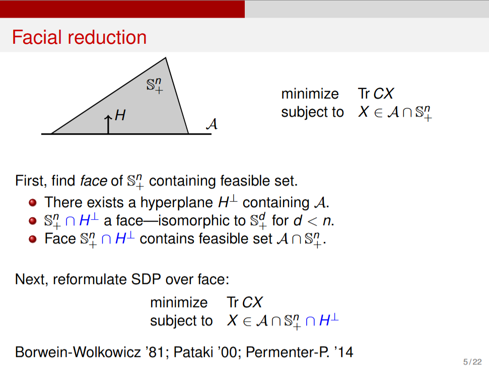
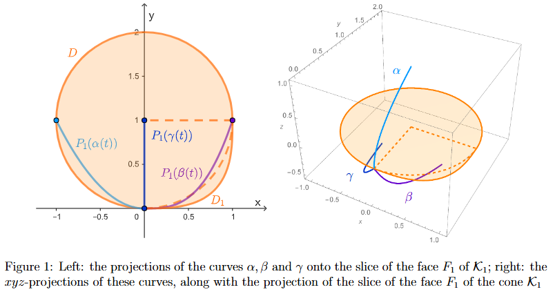

# CONTO2025

Cones: Theory and Optimization

December 1st-3rd, 2025

https://sites.google.com/view/conto2025

## Takayuki Okuno

[A Survey of Numerical Methods for Nonlinear Semidefinite Programming](https://orsj.org/wp-content/or-archives50/pdf/e_mag/Vol.58_01_024.pdf)
Hiroshi Yamashita and Hiroshi Yabe

**AKKT**: Approximate KTT (condition)

**MFCQ**: Mangasarian--Fromovitz Constraint Qualification

$$
\mathrm{rank}(\nabla g(x)) = m, \quad \exists d \in \mathbb{R}^n \text{ s.t. } \nabla g(x)^\top d = 0 \text{ and } X(x)+\mathcal{A}(x)d \succ 0
$$

## Masaru Ito

[Commutativity, majorization, and reduction in Fan--Theobald--von Neumann systems](https://arxiv.org/abs/2209.14175)
M. Seetharama Gowda, Juyoung Jeong

[Some P-properties for linear transformations on Euclidean Jordan algebras](https://www.sciencedirect.com/science/article/pii/S002437950400179X)
M. Seetharama Gowda, Roman Sznajder, J. Tao

### Jordan algebra

[Jordan algebra - Wikipedia](https://en.wikipedia.org/wiki/Jordan_algebra)

nonassociative algebra (非結合多元環, $(xy)z \neq x(yz)$) (with unit) over a field whose multiplication satisfies the following axioms:

1. $xy=yx$ (commutative law)
2. $(xx)(xy)=x((xx)y)$ (Jordan identity).

### Euclidean Jordan algebra

固有値分解（spectral decomposition）を備えた"行列代数の一般化"

A (possibly nonassociative) algebra over the real numbers is said to be **formally real** if it satisfies the property that a sum of n squares can only vanish if each one vanishes individually.

$$
a_1^2 + a_2^2 + \cdots + a_k^2 = 0 \implies a_1 = a_2 = \cdots = 0
$$

Not every Jordan algebra is formally real, but Jordan, von Neumann & Wigner (1934) classified the finite-dimensional formally real Jordan algebras, also called **Euclidean Jordan algebras**.

### Example: Symmetric Real Matrices

$$
X \circ Y = \frac{1}{2}(XY + YX)
$$

1. Commutative: $X \circ Y = Y \circ X$.
2. Jordan identity:

$$
\begin{align*}
     (X \circ X) \circ (X \circ Y)
  &= X^2 \circ \left(\frac{1}{2}(XY + YX)\right)\\
  &= \frac{1}{4}(X^3Y + X^2YX + XYX^2 + YX^3)\\
  &= X \circ \left(\frac{1}{2}(X^2Y + YX^2)\right)\\
  &= X \circ ((X \circ X) \circ Y).
\end{align*}
$$

## Anthony Man-Cho So

[A nonlinear programming algorithm for solving semidefinite programs via low-rank factorization](https://link.springer.com/article/10.1007/s10107-002-0352-8)
Samuel Burer & Renato D.C. Monteiro

標準形式の半正定値計画問題 (SDP) を低ランク因数分解 $X = R R^\top$ を用いて非線形計画問題 (NLP) に再定式化し、効率的な解法を提供

標準形式の主問題SDPは以下のように記述される:

$$
\begin{equation*}
\min\{C \bullet X : A_i \bullet X = b_i, i = 1, \ldots, m, X \succeq 0\} \quad (1) \quad
\end{equation*}
$$

$C, \{A_i\}_{i=1}^m \in S_n$ は $n \times n$ の実対称行列、$b \in \mathbb{R}^m$ はデータベクトル。

半正定値制約 $X \succeq 0$ を回避するため、$X$ を長方行列 $R \in \mathbb{R}^{n \times r}$ を用いて因数分解:

$$
X = R R^\top
$$

これにより、主問題SDP (1) は以下の非線形計画問題 $(N_r)$ として再定式化される:

$$
\begin{equation*}
(N_r) \quad \min\{C \bullet (R R^\top) : A_i \bullet (R R^\top) = b_i, i = 1, \ldots, m, R \in \mathbb{R}^{n \times r}\}
\end{equation*}
$$

最適解 $X^*$ のランク $r$ は、制約の数 $m$ に基づき制限される。これにより、計算量を削減するために、理論的に十分な最小ランク $\bar{r}$ を採用:

$$
\begin{equation*}
\bar{r} = \max\{r \geq 0 \;|\; r(r+1)/2 \leq m\}
\end{equation*}
$$

$R \in \mathbb{R}^{n \times \bar{r}}$ を用いることで、変数数を $n^2$ から $n\bar{r}$ へ削減。

問題 $(N_r)$ を解くために拡張ラグランジュ法が採用される。
拡張ラグランジュ関数 $L(R, y, \sigma)$ は、ラグランジュ乗数 $y \in \mathbb{R}^m$ とペナルティパラメータ $\sigma > 0$ を用いて次のように定義される:

$$
\begin{equation*}
L(R, y, \sigma) = C \bullet (R R^\top) - \sum_{i=1}^m y_i \left(A_i \bullet (R R^\top) - b_i\right) + \frac{\sigma}{2} \sum_{i=1}^m \left(A_i \bullet (R R^\top) - b_i\right)^2
\end{equation*}
$$

## Takashi Tsuchiya

[凸最適化の情報幾何と多項式時間内点法](https://www.math.is.tohoku.ac.jp/~amf/workshops/pdf/tsuchiya.pdf)
土谷 隆

[Closing Duality Gaps of SDPs through Perturbation](https://arxiv.org/abs/2304.04433)
Takashi Tsuchiya, Bruno F. Lourenço, Masakazu Muramatsu, Takayuki Okuno

### 標準形式の主双対半正定値計画問題 (SDP) のdual

実対称 $n \times n$ 行列 $C, A_i, X, S \in S^n$, $y \in \mathbb{R}^m$

$$
\begin{align*}
\min_{X} C \bullet X \quad \text{s.t.} \quad A_i \bullet X = b_i, \ i = 1, \ldots, m, \ X \succeq 0 \quad \text{(P)}\\
\max_{y,S} b^\top y \quad \text{s.t.} \quad C - \sum_{i=1}^m A_i y_i = S, \ S \succeq 0 \quad \text{(D)}
\end{align*}
$$

(P) と (D) の最適値はそれぞれ $v(P)$ と $v(D)$ で表される。
有限な非ゼロの双対ギャップが存在する場合、 $v(P) > v(D)$ となる。

### Regularized Primal-Dual Standard Form SDP (RPD-SDP)

主問題と双対問題のデータに摂動 $(\epsilon, \eta)$ を加えた正則化システム P$(\epsilon, \eta)$ および D$(\epsilon, \eta)$ は以下の通り:

$$
\begin{align*}
   \min_{X} (C + \epsilon I) \bullet X \quad \text{s.t.}\quad A_i \bullet X = b_i + \eta A_i \bullet I, \ i = 1, \ldots, m, \ X \succeq 0 \quad \text{P}(\epsilon, \eta)\\
   \max_{y,S} \sum_{i=1}^m (b_i + \eta A_i \bullet I) y_i \quad \text{s.t.} \quad C - \sum_{i=1}^m A_i y_i + \epsilon I = S, \ S \succeq 0 \quad \text{D}(\epsilon, \eta)
\end{align*}
$$

$\epsilon > 0$ かつ $\eta > 0$ の場合、Slaterの条件が満たされ、共通の最適値 $v(\epsilon, \eta)$ が存在。これをpd-regularized optimal value functionと呼ぶ。$\epsilon=\eta=0$ の場合、元の問題 (P) と (D) に戻る。

### 極限的なpd-regularized optimal value function

$v(\epsilon, \eta)$ を $(\epsilon, \eta) = (0, 0)$ の近傍で解析するために、方向極限が定義される。

方向 $\theta \in [0, \pi/2]$ に沿った極限 $v_a(\theta)$ は以下で定義される:

$$
v_a(\theta) \coloneqq \lim_{t \downarrow 0} v(t \cos \theta, t \sin \theta)
$$

基本的な性質として、以下の関係が成り立つ:

$$
v_a(0) = v(P), \quad v_a(\pi/2) = v(D)
$$

また、 $v_a(\theta)$ は $[0, \pi/2]$ で単調減少であり、開区間 $(0, \pi/2)$ で連続。

$\alpha = \cot \theta, \beta = \tan \theta$ を用いた代替的な関数 $\tilde{v}$ と $\bar{v}$ も定義される:

$$
\begin{align*}
   \tilde{v}(\beta) \coloneqq \lim_{t \downarrow 0} v(t, t\beta) \quad (0 \le \beta < \infty), \quad \tilde{v}(\infty) \coloneqq \lim_{t \downarrow 0} v(0, t) = v(D)\\
   \bar{v}(\alpha) \coloneqq \lim_{t \downarrow 0} v(t\alpha, t) \quad (0 \le \alpha < \infty), \quad \bar{v}(\infty) \coloneqq \lim_{t \downarrow 0} v(t, 0) = v(P)
\end{align*}
$$

### 特異度1の仮定の下での主要結果

主問題 (P) および双対問題 (D) の両方が特異度 (singularity degree) 1 を持つという仮定の下で、 $v_a(\theta)$ の連続性と全単射性が示される。

**singularity degree**: facial reduction の最小回数

連続性の結果 (Theorem 3.1)

> 1. D の特異度が 1 の場合、 $v_a(\theta)$ は $\theta = \pi/2$ で連続
> 2. P の特異度が 1 の場合、 $v_a(\theta)$ は $\theta = 0$ で連続
> 3. P と D の両方の特異度が 1 の場合、 $v_a(\theta)$ は $[0, \pi/2]$ 全体で連続

これがfilling nonzero duality gapとなることが主結果

## Renato D.C. Monteiro

[cuHALLaR: A GPU Accelerated Low-Rank Augmented Lagrangian Method for Large-Scale Semidefinite Programming](https://arxiv.org/abs/2505.13719)
Jacob M. Aguirre, Diego Cifuentes, Vincent Guigues, Renato D.C. Monteiro, Victor Hugo Nascimento, Arnesh Sujanani

ALMのGPU実装

**Augmented Lagrangian Method**: 拡張ラグランジュ関数法(ALM)

[拡張ラグランジュ関数法 - Wikipedia](https://ja.wikipedia.org/wiki/%E6%8B%A1%E5%BC%B5%E3%83%A9%E3%82%B0%E3%83%A9%E3%83%B3%E3%82%B8%E3%83%A5%E9%96%A2%E6%95%B0%E6%B3%95)

一般に、次の制約付き最適化問題を考える:

$$
\begin{align*}
   \min_{\mathbf{x}}&\quad f(\mathbf{x})\\
   \text{subject to}&\quad c_i(\mathbf{x}) = 0 \;\; \forall i \in \mathcal{E}.
\end{align*}
$$

ここで、$\mathcal{E}$ は等式制約の集合である。これは無制約最小化問題の形に書き換えて解くことができる。

$k$ 回目の反復におけるペナルティ関数法の例を示す:

$$
\min_{\mathbf{x}} \, \Phi_k(\mathbf{x})
= f(\mathbf{x}) + \mu_k \sum_{i\in\mathcal{E}} c_i(\mathbf{x})^2 .
$$

一方、拡張ラグランジュ関数法では次の目的関数を用いる:

$$
\min_{\mathbf{x}}\,
\Phi_k(\mathbf{x})
= f(\mathbf{x})
+ \frac{\mu_k}{2}\sum_{i\in\mathcal{E}} c_i(\mathbf{x})^2
+ \sum_{i\in\mathcal{E}} \lambda_i\, c_i(\mathbf{x}) .
$$

各反復において $\mu_k$ を更新し、$\lambda$ も次のように更新する:

$$
\lambda_i \leftarrow \lambda_i + \mu_k\, c_i(\mathbf{x}_k),
$$

ここで、$\mathbf{x}_k$ は $k$ 番目の反復での解（例:$\mathbf{x}_k=\arg\min_{\mathbf{x}} \Phi_k(\mathbf{x})$）である。

変数 $\lambda$ はラグランジュ乗数に対応しており、反復を進めるにつれ真の乗数に近づいていく。拡張ラグランジュ関数法の利点は、ペナルティ関数法と異なり $\mu \to \infty$ とする必要がない点にある。これは目的関数にラグランジュ乗数項が含まれているため、小さな $\mu$ でも ill-conditioning が発生しにくいためである。しかし実際には、数値誤差の抑制と収束性の保証の観点から、高次元の有界集合へのラグランジュ乗数の射影が用いられる。

この手法は不等式制約付き最適化問題にも拡張されている。

## Bruno F. Lourenço

[Error bounds, facial residual functions and applications to the exponential cone](https://link.springer.com/article/10.1007/s10107-022-01883-8)
Scott B. Lindstrom, Bruno F. Lourenço & Ting Kei Pong

[Error Bounds and Facial Residual Functions for Conic Linear Programs](https://bflourenco.github.io/slides/2022/owos.pdf)
Bruno F. Louren ̧co

$$
\begin{align*}
\text{find }& x \\
\text{subject to }& x \in (\mathcal{L}+a) \cap \mathcal{K}
\end{align*}
$$

* $K$: closed convex cone contained in some space $\mathcal{E}$.
* $L$: subspace contained in $\mathcal{E}$.
* $a \in \mathcal{E}$.

[Hölderian error bounds from arXiv](https://arxiv.org/pdf/1810.02429)

Def 3.5:

> $f$: convex function,
> $K$: compact neighborhood of $X^*$ in $\mathcal{C}$,
> $\theta \in [0,1/2]$,
> $c > 0$.
> For all $x \in K$,
>
> $$
> \min_{x^* \in X^*} \|x - x^*\| \le c (f(x) - f_*)^{\theta}
> $$

## Ying Lin

[FACIAL REDUCTION FOR A CONE-CONVEX PROGRAMMING PROBLEM](https://www.math.uwaterloo.ca/~hwolkowi/henry/reports/facereducconopt80.pdf)
JON M. BORWEIN and HENRY WOLKOWICZ

[A Simple Derivation of a Facial Reduction Algorithm and Extended Dual Systems](https://gaborpataki.web.unc.edu/wp-content/uploads/sites/14119/2018/07/fr.pdf)
Gabor Pataki

> (P) is always equivalent to a strictly feasible system
>
> $$
> A x \leq_{F_{\min}} b,
> $$
>
> where $F_{\min}$ is a face of $K$, called the minimal cone of $(P)$.
> Therefore, as $F_{\min}$ is a closed convex cone, Theorem 1.1 holds without
> requiring a CQ, if we replace $y \geq_{K^\ast} 0$ with
>
> $$
> y \geq_{F_{\min}^\ast} 0.
> $$
>
> The technique of deriving duality results using the minimal cone is called **facial reduction**. Furthermore, they provide an algorithm to construct a sequence of faces
>
> $$
> K = F_{0} \supseteq \cdots \supseteq F_{t} = F_{\min}
> $$
>
> for some $t \ge 0$. We shall call their method a Facial Reduction Algorithm (FRA).

Screenshot from [Dimension reduction for semidefinite programming by Pablo A. Parrilo](https://www.princeton.edu/~aaa/Public/Presentations/CDC_2016_Parrilo_2)

## Mitsuhiro Nishijima

(Omitted)

## Vera Roshchina

[Inner approximations of convex sets and intersections of projectionally exposed cones](https://arxiv.org/abs/2501.12717)
Bruno F. Lourenço, Vera Roshchina, James Saunderson

> A convex cone is said to be projectionally exposed (p-exposed) if every face arises as a projection of the original cone. It is known that, in dimension at most four, the intersection of two p-exposed cones is again p-exposed. In this paper we construct two p-exposed cones in dimension 5 whose intersection is not p-exposed.

Let $K \subseteq \mathbb{R}^n$ be a closed convex cone.

$$
\begin{gather*}
  K \text{ is amenable }\\
  \iff\\
  \text{for every face } F \unlhd K \text{ there exists } \kappa > 0 \text{ such that }\\
  \operatorname{dist}(x, F) \le \kappa \operatorname{dist}(x, K) \quad \forall x \in \operatorname{span} F.
\end{gather*}
$$

($unlhd$ means "is a face of")

## Michael Orlitzky

[Isometric automorphism identities for symmetric, homogeneous, and hyperbolicity cones](https://michael.orlitzky.com/documents/presentations/isometric_automorphism_identities_for_symmetric%2C_homogeneous%2C_and_hyperbolicity_cones.pdf)
Michael Orlitzky

### Hyperbolic

The pair $(p, e)$ is hyperbolic in $\mathbb{R}^n$ if

* $p\colon \mathbb{R}^n \to \mathbb{R}$ is a homogeneous polynomial,
* $e \in \mathbb{R}^n$ and $p(e) > 0$,
* the roots of the univariate polynomial $\lambda \mapsto p(\lambda e - x)$ are real for all $x \in \mathbb{R}^n$.

The pair $(\det, I)$ is hyperbolic in $S^n$.
We can express $\det$ as a homogeneous polynomial of degree $n$ on $S^n$, and the roots of $\lambda \mapsto \det(\lambda I - X)$ are the (all real) eigenvalues of $X$.

### Hyperbolicity cone

The hyperbolicity cone of a hyperbolic pair $(p, e)$ is,

$$
\Lambda_{p, e} = \{x \in \mathbb{R}^n \;|\; \lambda{}_{p,e}(x) = \text{(the real roots of $\lambda \mapsto p(\lambda e - x)$ are nonnegative)}\}.
$$

## Godai Azuma

[ICCOPT2025 Presentation](https://godazm.org/slide/20250722_ICCOPT2025.pdf)

[CONTO_20251202_Azuma.pdf](https://www.dropbox.com/scl/fi/1hv2lh47tdqebm8ijptpe/CONTO_20251202_Azuma.pdf?rlkey=qgvvqjnbb674aofwx5qasdok1&e=1&st=grexinka&dl=0)

[On the Tightness of Semidefinite Relaxations for Certifying Robustness to Adversarial Examples](https://arxiv.org/pdf/2006.06759)
Richard Y. Zhang

[Quadratically constrained quadratic program - Wikipedia](https://en.wikipedia.org/wiki/Quadratically_constrained_quadratic_program)

**QUBO**: Quadratic Unconstrained Binary Optimization

**QCQP**: Quadratically Constrained Quadratic Programming

**SDP**: Semidefinite Programming

$\text{QUBO} \subseteq \text{QCQP} \xrightarrow{\text{relax}} \text{SDP}$

$$
\begin{align*}
\text{minimize} \quad& \frac{1}{2} x^\top P_0 x + q_0^\top x \\
\text{subject to} \quad& \frac{1}{2} x^\top P_i x + q_i^\top x + r_i \le 0, \quad i = 1, \ldots, m\\
&Ax = b
\end{align*}
$$

$x^\top P x = \operatorname{Tr}(P x x^\top)$ を利用して、$X = x x^\top$ と置く。

$$
\operatorname{rank}\begin{bmatrix}
1 & x^\top \\
x & X
\end{bmatrix} = 1
$$

を除くと、次のように緩和できる:

$$
\begin{align*}
\text{minimize} \quad& \frac{1}{2} \operatorname{Tr}(P_0 X) + q_0^\top x \\
\text{subject to} \quad& \frac{1}{2} \operatorname{Tr}(P_i X) + q_i^\top x + r_i \le 0, \quad i = 1, \ldots, m\\
&Ax = b\\
&\begin{bmatrix}
1 & x^\top \\
x & X
\end{bmatrix} \succeq 0
\end{align*}
$$

## Zhi-Quan Luo

[Relaxation-Free Min-k-Partition for PCI Assignment in 5G Networks](https://arxiv.org/abs/2506.10362)
Yeqing Qiu, Chengpiao Huang, Ye Xue, Zhipeng Jiang, Qingjiang Shi, Dong Zhang, Zhi-Quan Luo

## Ellen Hidemi Fukuda

[A second-order sequential optimality condition for nonlinear second-order cone programming problems](https://link.springer.com/article/10.1007/s10589-025-00649-0)
Ellen H. Fukuda & Kosuke Okabe

[A strong second-order sequential optimality condition for nonlinear programming problems](https://arxiv.org/abs/2503.01430)
Huimin Li, Yuya Yamakawa, Ellen H. Fukuda, Nobuo Yamashita

[Optimality Conditions for Nonlinear Semidefinite Programming via Squared Slack Variables](https://arxiv.org/abs/1512.05507)
Bruno F. Lourenço, Ellen H. Fukuda, Masao Fukushima

**NLP**: [Nonlinear Programming](https://en.wikipedia.org/wiki/Nonlinear_programming)
**NSOCP**: Nonlinear Second-Order Cone Programming
**NSDP**: Nonlinear Semidefinite Programming
**NSCP**: Nonlinear Symmetric Cone Programming

$$
\begin{align*}
\min_{x \in \mathbb{R}^n} & f(x), \quad\\
\text{s.t. } &g_i(x) \le 0,\; i=1,\dots,m,\\
&h_j(x) = 0,\; j=1,\dots,p,
\end{align*}
$$

ここで $g_i, h_j$ は十分に滑らか (少なくとも連続微分可能) と仮定する。

このとき，局所最適性に関する必要条件 (例えば KKT条件) を導くには，単に勾配等を並べるだけでは不十分であり，「制約の幾何的な性質」に関するいわゆる制約資格 (constraint qualification, CQ) が必要となる。

### 線形独立制約資格 (LICQ)

有効 (active) な不等式制約の勾配 $\nabla g_i(x^*)$（すなわち $g_i(x^*) = 0$ となるもの）および等式制約の勾配 $\nabla h_j(x^*)$ がすべて点 $x^*$ において線形独立である。

### Mangasarian–Fromovitz 制約資格 (MFCQ)

[Mangasarian–Fromovitz constraint qualification - Wikipedia](https://de.wikipedia.org/wiki/Mangasarian-Fromovitz_constraint_qualification)

点 $x^*$ が満たすべき条件は次の通り:

* 等式制約の勾配 $\{\nabla h_j(x^*)\}$ は線形独立。
* ある方向ベクトル $d \in \mathbb R^n$ が存在し，すべての有効不等式制約に対して $\nabla g_i(x^*)^\top d < 0$，かつ等式制約に対して $\nabla h_j(x^*)^\top d = 0$ を満たす。

幾何的には，「等式制約を満たしながら，すべての有効な不等式制約を緩和 (inward) する方向がある」という直感である。
MFCQ は LICQ より弱く (すなわち一般性が高く)，多くの問題で適用可能。

### Constant Rank 制約資格 (CRCQ)

[Karush–Kuhn–Tucker conditions - Wikipedia](https://en.wikipedia.org/wiki/Karush%E2%80%93Kuhn%E2%80%93Tucker_conditions)

[Constant rank theorem - Wikipedia](https://en.wikipedia.org/wiki/Inverse_function_theorem#Constant_rank_theorem)

点 $x^*$ の近傍において，任意の「有効不等式制約の勾配 および 等式制約の勾配の任意の部分集合」の集合のランクが変わらない (constant) こと。つまり，勾配の線形独立性／従属性の関係が近傍で保存される。

CRCQ は LICQ を含むが，必ずしも MFCQ を含むわけでも，逆に含まれるわけでもない。

## Chao Ding

[A quadratically convergent semismooth Newton method for nonlinear semidefinite programming without generalized Jacobian regularity](https://arxiv.org/abs/2402.13814)
Fuxiaoyue Feng, Chao Ding, Xudong Li

## Xudong Li

[A highly efficient semismooth Newton augmented Lagrangian method for solving Lasso problems](https://arxiv.org/abs/1607.05428)
Xudong Li, Defeng Sun, Kim-Chuan Toh

Semismooth Newton Method

### Mixed Complementarity Problem (MCP)

$$
z\in [\ell,u],\quad
\langle \Phi(z), y-z \rangle \ge 0\quad\forall y\in[\ell,u].
$$
ここで $\Phi\colon\mathbb{R}^s\to\mathbb{R}^s$ は与えられた写像、区間は $[\ell,u]=\{z\in\mathbb{R}^s\mid \ell_i\le z_i\le u_i,\ i=1,\dots,s\}$ とする。

これは、$\Psi\colon\mathbb{R}^s\to\mathbb{R}^s$ を適切に定めれば、
$$
\Psi(z) = 0
$$
と書き換えられる。

### 一般化微分

$S_\Psi$ を $\Psi$ が微分可能な点の集合とする。
B-差分（B-differential:
$$
   \partial_B\Psi(\bar z)
    \;=\;
   \{ J\in\mathbb{R}^{s\times s}\mid \exists\{z^k\}\subset S_\Psi,\ z^k\to\bar z,\ \nabla\Psi(z^k)\to J \}.
$$

Clarke の一般化ヤコビアン:
$$
    \partial\Psi(\bar z) \;=\; \operatorname{conv}\big(\partial_B\Psi(\bar z)\big),
$$
すなわち $\partial_B\Psi(\bar z)$ の凸包をとった集合である。

### regularity

$$
\begin{align*}
&\text{BD-regular at }\bar z \quad\Longleftrightarrow\quad
\forall J\in\partial_B\Psi(\bar z),\ \det J \neq 0, \\
&\text{CD-regular at }\bar z \quad\Longleftrightarrow\quad
\forall J\in\partial\Psi(\bar z),\ \det J \neq 0.
\end{align*}
$$

## Akiko Yoshise

[Proactive Privacy-preserving Learning for Cross-modal Retrieval](https://dl.acm.org/doi/10.1145/3545799)
Peng-Fei Zhang, Guangdong Bai, Hongzhi Yin, Zi Huang
